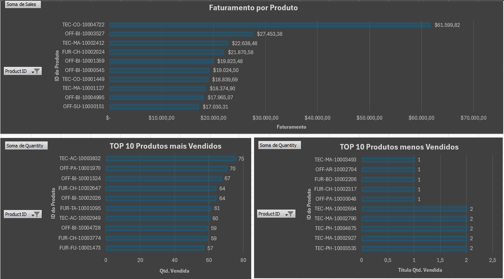
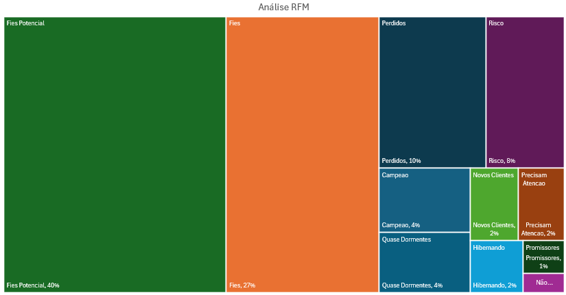
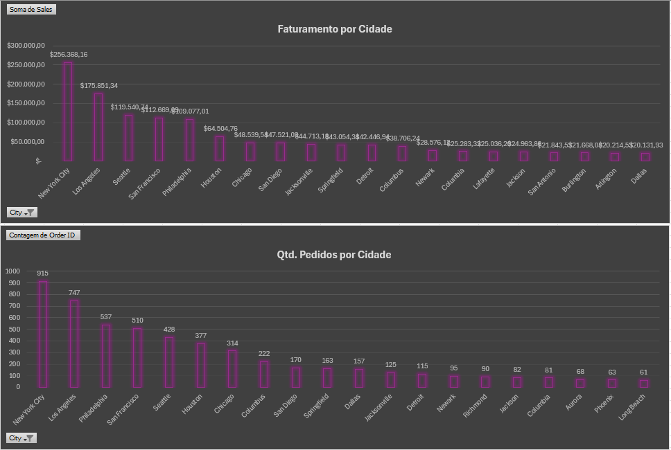
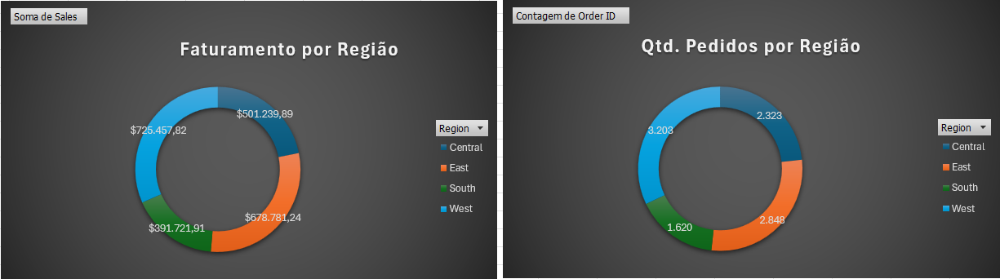

# Projeto SuperStore - Análise de Dados com Excel
## Sobre o Projeto
Este projeto foi desenvolvido como parte do curso de Análise de Dados, aplicando técnicas avançadas de Excel para resolver os problemas de negócio da SuperStore, uma das maiores redes de E-commerce do país. O projeto utiliza análise de cohort, segmentação RFM e análise de desempenho para gerar insights acionáveis.

## Problema de Negócio
A SuperStore enfrenta desafios relacionados à retenção de clientes e à melhoria das suas estratégias de vendas. A empresa possui dados ricos sobre clientes, pedidos, localizações e produtos, mas precisa de uma análise detalhada para tomar decisões baseadas em dados.

## Premissas da Análise
Foram analisados dados históricos de transações de vendas contemplando:

* Informações de clientes (Customer ID, dados de compra)
* Pedidos (Order ID, Order Date, Sales)
* Produtos e categorias
* Localizações das lojas

## Contexto
A SuperStore, uma das maiores redes de supermercados do país, identificou três áreas principais que precisam de atenção:

1. Retenção de Clientes: Monitorar a interação de clientes ao longo do tempo para entender padrões de fidelização
2. Segmentação de Clientes: Identificar grupos específicos de clientes com base no comportamento de compra
3. Desempenho de Produtos e Localizações: Avaliar quais produtos e lojas geram maior impacto no faturamento

O time de gestão necessita de uma análise para responder às seguintes perguntas:
#### Perguntas de Negócio

1. Como está a retenção de clientes ao longo dos meses?
2. Quais cohorts apresentam maior e menor retenção?
3. Quem são os clientes "Campeões" e "Clientes em Risco"?
4. Como os clientes estão distribuídos entre os segmentos RFM?
5. Quais produtos geram maior receita e quais possuem baixo desempenho?
6. Existe uma relação entre o desempenho das lojas e as regiões em que estão localizadas?

## Estratégia da Solução
#### Passo 1: Preparação e importação dos dados (orders.csv, location.csv)
#### Passo 2: Análise de Cohort

* Identificação do mês de aquisição de cada cliente
* Construção da tabela de cohort
* Criação de heatmap de retenção

#### Passo 3: Segmentação RFM

* Cálculo das métricas (Recência, Frequência, Monetização)
* Atribuição de notas RFM em quintis
* Classificação em segmentos de clientes

#### Passo 4: Análise de Produtos e Localizações

* Ranking de produtos por receita
* Análise de desempenho regional
* Identificação de oportunidades

#### Passo 5: Criação de visualizações e dashboard interativo
#### Passo 6: Elaboração de relatório consolidado com recomendações
### Ferramentas Utilizadas

* Microsoft Excel
* Tabelas Dinâmicas
* Power Query
* Formatação Condicional
* Fórmulas Avançadas (TEXTO, MÁXIMOSE, ÍNDICE, CORRESP, PROCV, MÍNIMOSES, CONT.VALORES, PERCENTIL, ARRED)
* Gráficos de visualização (Heatmaps, Tree Maps, Gráficos de Barras, Pizza, Rosca)

## Hipóteses Analisadas
#### 1. Análise de Cohort

* Qual é a taxa de retenção por mês de aquisição?
* Quais cohorts apresentam maior fidelização?
* Existem padrões sazonais na retenção?

#### 2. Segmentação RFM

* Qual a distribuição de clientes entre os segmentos?
* Quais segmentos geram maior receita?
* Como identificar clientes prioritários para ações de marketing?

#### 3. Desempenho de Produtos e Localizações

* Quais produtos lideram em faturamento?
* Quais produtos têm baixo desempenho?
* Qual a performance de cada região?
* Existe concentração de vendas em regiões específicas?

## Insights da Análise
#### 1. Análise de Cohort
#### Resultado da Análise de Cohort:
A análise revelou **desafios críticos de retenção** que exigem ação imediata:

**Taxa de Retenção Inicial:**
* **Retenção Mês 1**: Apenas 0-8% dos clientes retornam no mês seguinte à primeira compra
* **Padrão Errático**: Alta volatilidade com oscilações entre 0% e 26% ao longo dos meses

**Cohorts de Melhor Performance:**
* **Setembro/2015**: 18% de retenção após 24 meses (maior longevidade)
* **Abril/2016**: Pico de 26% de retenção no 5º mês
* **Junho/2016**: Manutenção consistente de 15-19% entre meses 15-17
* **Janeiro/2014**: 13% de retenção após 22-23 meses

**Cohorts de Pior Performance:**
* **Dezembro/2017**: 0% de retenção em todos os períodos subsequentes
* **Novembro/2017**: Apenas 7% no mês 1, seguido de abandono total
* **Período 2017**: Deterioração generalizada comparado a anos anteriores

#### 2. Análise de Segmentação RFM
#### Resultado da Análise RFM:
A segmentação revelou **distribuição preocupante** com concentração em segmentos intermediários e fragilidade nas extremidades de valor:

**Distribuição por Segmento:**

**Segmentos de Maior Valor:**
* **Campeões (4%)**: Clientes de elite com compras frequentes, valores altos e recência baixa
  * **CRÍTICO**: Apenas 4% da base no segmento mais valioso (ideal: 10-15%)
  * Responsáveis por proporção desproporcional da receita
  
* **Promissores (1%)**: Novos clientes com alto potencial inicial
  * Pipeline insuficiente para crescimento do segmento Campeões

**Segmentos Intermediários:**
* **Fiéis Potencial (40%)**: Maior segmento, representa enorme oportunidade de conversão
  * Clientes com padrão regular mas não otimizado
  * Potencial de upgrade para Fiéis ou Campeões

* **Fiéis (27%)**: Base sólida de clientes recorrentes
  * Fundação estável do negócio
  * Necessitam estratégias de manutenção e upgrade

**Segmentos em Risco:**
  * **Perdidos (10%)**: Taxa de churn elevada
  * **Risco (8%)**: Em processo ativo de abandono
  * **Quase Dormentes (4%)**: Próximos da inatividade
  * **Hibernando (2%)**: Inativos mas recuperáveis
  * **Precisam Atenção (2%)**: Sinais de alerta detectados
  * **Não Perder (1%)**: Alto valor em risco crítico

**Total em Risco: 27%** - Para cada cliente fiel, existe um cliente em processo de saída

**Segmento de Crescimento:**
* **Novos Clientes (2%)**: Taxa de aquisição criticamente baixa
  * **ALERTA**: Pipeline de crescimento comprometido
  * Benchmark ideal: 5-10%

#### 3. Análise de Produtos
#### Resultado da Análise de Produtos:
A análise revelou **concentração de risco extrema** e oportunidades de otimização de portfólio:

**Desempenho por Produto:**

**Concentração de Receita:**
* **Produto Líder (TEC-CO-10004722)**: $61,599.82 em faturamento
  * **CRÍTICO**: Representa mais que o dobro do 2º colocado
  * Dependência perigosa de um único SKU
  * Risco elevado caso produto entre em declínio

**Top 10 Produtos:**
* **Technology**: 3 produtos (alto ticket médio)
* **Office Supplies**: 5 produtos (volume equilibrado)
* **Furniture**: 2 produtos (ticket médio-alto)

**Paradoxo Volume vs. Valor:**
* **Produtos de maior faturamento ≠ Produtos de maior volume**
* Alto faturamento = Baixo volume + Alto ticket (Technology)
* Alto volume = Baixo ticket (Office Supplies)

**Produtos de Baixo Desempenho:**
* 10 produtos venderam apenas 1-2 unidades
* **Recomendação**: Avaliar descontinuação ou liquidação
* Potencial estoque parado representando custo de oportunidade

#### 4. Análise de Localizações
#### Resultado da Análise Regional:
A distribuição geográfica apresenta **concentração de risco urbana** com oportunidades regionais inexploradas:

**Desempenho por Cidade:**

**Concentração Urbana Crítica:**
* **New York City**: $256,368 (25-30% do faturamento total)
  * 915 pedidos (12% do volume)
  * **RISCO MÁXIMO**: Dependência perigosa de uma única cidade
  * Qualquer instabilidade em NYC impacta significativamente o negócio

**Top 5 Cidades:**
1. New York City: $256K | 915 pedidos
2. Los Angeles: $176K | 747 pedidos
3. Seattle: $120K | 428 pedidos **Ticket médio ALTO**
4. San Francisco: $113K | 510 pedidos
5. Philadelphia: $109K | 537 pedidos **Ticket médio BAIXO**

**Insight Crítico - Ticket Médio por Cidade:**
* Seattle: Menos pedidos que Philadelphia, mas mais faturamento
  * Indica clientes de **maior valor** (Technology?)
* Philadelphia: Mais pedidos, menos faturamento
  * Predominância de **Office Supplies** (baixo ticket)

#### Análise Regional Profunda:
**West (Melhor Performance):**
* Menos pedidos, mais faturamento
* Clientes compram produtos de maior valor
* Concentração de Technology e Furniture premium
* Manter estratégia atual

**East (Alto Volume, Baixo Retorno):**
* 37% dos pedidos, apenas 31% do faturamento
* Predominância de Office Supplies (baixo ticket)
* **Oportunidade**: Estratégias de upsell e cross-sell
* Introduzir produtos Technology de entrada

**Central (Performance Equilibrada):**
* Proporção balanceada volume/faturamento
* Potencial de crescimento em todas as categorias
* Replicar estratégias de sucesso de West e East

**South (Oceano Azul):**
* **MENOR** faturamento (18%)
* Região menos explorada
* **MAIOR OPORTUNIDADE DE CRESCIMENTO**
* Potencial de duplicar faturamento com estratégia focada

## Resultado

As análises mostraram que a SuperStore apresenta oportunidades significativas de melhoria em três frentes principais:

**Retenção:** A ausência de um padrão consistente de recompra indica que a SuperStore opera majoritariamente com **compras esporádicas** em vez de clientes recorrentes. Menos de 10% dos clientes desenvolvem hábito de compra regular, representando significativa oportunidade de melhoria.

**Segmentação:** A análise RFM revela **desequilíbrio estrutural** na base de clientes: pirâmide invertida com excesso de clientes intermediários (67% em Potencial+Fiéis), base de elite insuficiente (5% em Campeões+Promissores), e vazamento significativo (27% em risco). Urgência em: (1) Desenvolver programa de progressão Potencial→Fiéis→Campeões, (2) Acelerar aquisição de novos clientes, (3) Implementar retenção agressiva dos segmentos de risco.

**Performance Produtos e Região:** Portfólio bem diversificado em categorias, mas com concentração de risco em SKUs individuais. Furniture apresenta o melhor equilíbrio entre ticket médio e volume, representando oportunidade de crescimento prioritário.
Concentração perigosa em NYC (25-30% do negócio) representa vulnerabilidade estrutural. Região South subexplorada oferece maior oportunidade de crescimento. Disparidade de ticket médio entre regiões indica necessidade de personalização de mix de produtos por geografia.

## Visualize a Análise Completa
**Você pode acessar a planilha completa e interativa através do link abaixo:**
(https://docs.google.com/spreadsheets/d/1sAUNAI6uL2pktMvUCrdM42YWWmtNn9QS/edit?usp=sharing&ouid=110374129430590839789&rtpof=true&sd=true)
## Próximos Passos

1. Implementar sistema de monitoramento contínuo das métricas RFM
2. Desenvolver modelo preditivo de churn de clientes
3. Criar análise de cesta de compras (Market Basket Analysis)
4. Implementar testes A/B para validar recomendações
5. Expandir análise para incluir dados de satisfação do cliente
6. Desenvolver dashboard automatizado com atualização em tempo real
